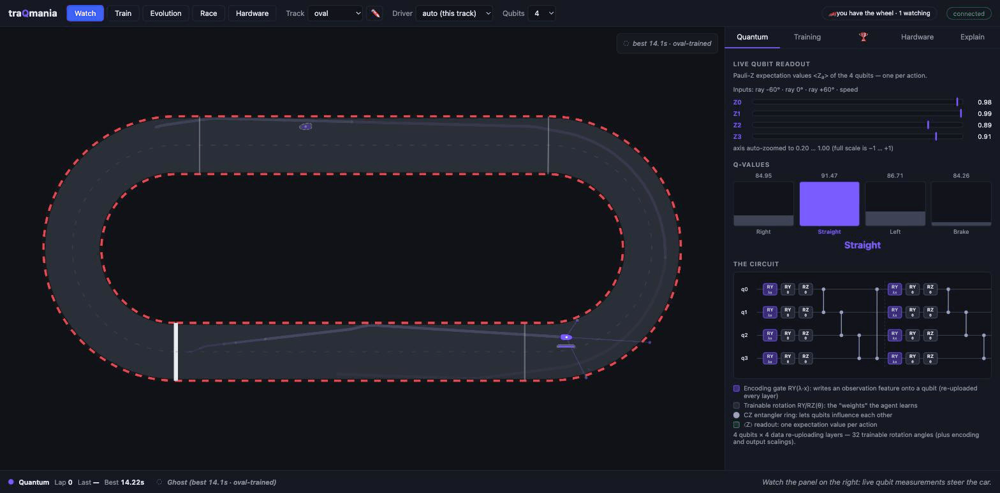

# traQmania 🏎️

**A quantum reinforcement learning demo, Trackmania-style.** Watch a variational
quantum circuit learn to race — then grab the keyboard and try to beat it.



- Quantum Deep Q-Learning (4 qubits / 56 trainable parameters by default; a
  trained 6-qubit / 80-parameter variant ships behind `--profile q6`) built on
  [Qiskit](https://www.ibm.com/quantum/qiskit) and
  [qiskit-machine-learning](https://github.com/qiskit-community/qiskit-machine-learning),
  anchored in [Chen et al., *Variational Quantum Circuits for Deep Reinforcement
  Learning* (IEEE Access 2020)](https://research.ibm.com/publications/variational-quantum-circuits-for-deep-reinforcement-learning).
- Classical numpy baseline with comparable parameter count, trained side-by-side.
- Live training you can watch in minutes, bundled pre-trained weights,
  human-vs-quantum race mode, optional laps on real IBM Quantum hardware.
- Runs on a laptop or a Raspberry Pi; environments based on
  [QuBins](https://qubins.org) images.

## Quick start

```sh
./run.sh                    # venv + install + launch, opens http://127.0.0.1:8000
./run.sh --profile pi5      # Raspberry Pi 5 profile
./run.sh --profile q6       # 6-qubit circuit: 5 lidar rays, 80 parameters
```

Or with Docker (multi-arch, works on a Pi):

```sh
docker run --rm -p 8000:8000 ghcr.io/janlahmann/traqmania
```

## Notebooks

Six teaching notebooks build the whole stack up from scratch — no local install
needed, each badge launches on Binder (via [QuBins](https://qubins.org) `xl`
images with Qiskit preinstalled):

| Notebook | What it covers | Launch |
|---|---|---|
| [01 — The racing environment](notebooks/01_the_racing_env.ipynb) | tracks, car physics (why you must brake for hairpins), lidar, reward, a scripted lap | [](https://qubins.org/launch/?image=latest-xl&repo=https://github.com/JanLahmann/traQmania&branch=main&path=notebooks/01_the_racing_env.ipynb) |
| [02 — Q-learning from scratch](notebooks/02_q_learning_from_scratch.ipynb) | MDPs, double DQN in pure numpy, a 76-parameter MLP learns to lap in seconds | [](https://qubins.org/launch/?image=latest-xl&repo=https://github.com/JanLahmann/traQmania&branch=main&path=notebooks/02_q_learning_from_scratch.ipynb) |
| [03 — Quantum circuits as Q-functions](notebooks/03_quantum_circuits_as_q_functions.ipynb) | the data re-uploading VQC, expressivity, fastsim ≡ `EstimatorQNN`, dead parameters, adjoint vs param-shift | [](https://qubins.org/launch/?image=latest-xl&repo=https://github.com/JanLahmann/traQmania&branch=main&path=notebooks/03_quantum_circuits_as_q_functions.ipynb) |
| [04 — Training the quantum driver](notebooks/04_training_the_quantum_driver.ipynb) | live quantum DQN training, quantum-vs-classical curves over seeds, lap-time table, honest takeaways | [](https://qubins.org/launch/?image=latest-xl&repo=https://github.com/JanLahmann/traQmania&branch=main&path=notebooks/04_training_the_quantum_driver.ipynb) |
| [05 — Real quantum hardware](notebooks/05_real_quantum_hardware.ipynb) | shots, device noise, SPSA hardware sprints, and laps on IBM Quantum devices | [](https://qubins.org/launch/?image=latest-xl&repo=https://github.com/JanLahmann/traQmania&branch=main&path=notebooks/05_real_quantum_hardware.ipynb) |
| [06 — More qubits or better features?](notebooks/06_scaling_and_features.ipynb) | sensor scaling 4→10 qubits vs engineered observations, learning curves over seeds, matched MLP baselines, the gp failure-and-rescue | [](https://qubins.org/launch/?image=latest-xl&repo=https://github.com/JanLahmann/traQmania&branch=main&path=notebooks/06_scaling_and_features.ipynb) |

## Measured results (Apple Silicon laptop, physics v2)

All numbers below are measured under the **v2 physics** (2026-07): faster
straights (`v_max` 22 → 25, stronger engine and brakes) with unchanged
hairpin discipline, so speed *varies* visibly — the model-based hero driver's
max/min speed ratio is 1.81 on gp and 1.79 on combo (≈1.5 before), while the
oval and chicane corners are gentle enough to stay flat-out at any of these
speeds. The flip side, reported honestly below: the harder approach speeds
make gp and combo tougher for the 4-qubit circuit — an overnight recipe
sweep won back most of the gp gap (slower epsilon decay; seed-robust,
laps at 3/3 seeds), while fresh training on combo still never laps
(only warm-started runs do).

| Track | Quantum first clean lap | Best lap (greedy best-snapshot) | Classical MLP best lap |
|---|---|---|---|
| oval | ~18 s training (ep ≈ 381) | 14.1 s | 13.2 s |
| chicane | ~25 s training (ep ≈ 450) | 12.5 s | 13.5 s |
| gp | ~123 s training (ep ≈ 1794) | 23.2 s | 20.3 s |
| combo | ~79 s training (ep ≈ 1034, warm-started) | 27.5 s | 30.8 s |

**Scaling qubits vs engineering features** (oval; greedy best-snapshot eval,
bundled driver's seed). Extra qubits widen the observation register: either more lidar rays
("rays + speed") or hand-engineered features (track curvature ahead,
corner-speed ratio, lateral offset, heading error):

| Qubits (profile) | Params | Best oval lap, rays + speed | Best oval lap, engineered features |
|---|---|---|---|
| 4 (default) | 56 | 14.1 s | — (register full: 3 rays + speed) |
| 6 (`q6`) | 80 | 13.3 s | 13.2 s |
| 8 (`q8`) | 104 | 13.3 s | 12.5 s |
| 10 (`q10`) | 128 | **12.0 s** | 13.5 s |

Sample efficiency stays roughly flat from 4 to 10 qubits (first clean lap
between episode ~200 and ~515 everywhere); what grows is per-decision compute,
as the statevector goes 16 → 1024 amplitudes (fastsim greedy: ≲1 ms per
decision at 4–6 qubits, ~1.2–2 ms at 8, ~5–9 ms at 10). Seed-honesty from
the three-seed spreads: the table quotes seed 42, but the ranges overlap —
the q10 driver's 12.0 s headline is the best of three seeds (spread
12.0–14.2 s), and the apparent feature win at q8 (12.5 s) does not survive
its spread either (12.5–13.8 s vs plain q8's 12.5–13.3 s; details in
docs/SCIENCE.md). The matched MLP baselines (92–124 params,
~0.01 ms/decision) still match or beat every quantum lap — 11.9 s at the
q10 observation vs quantum's 12.0 s is the closest the two have ever been,
but it stays parity, not advantage.
`quantum_oval_q8.npz`, `quantum_chicane_q8.npz` and the q10 pair now ship, so
the Qubits selector works out of the box for oval and chicane at every size;
gp/combo ship no weights above 4 qubits, but not for capacity reasons:
with the swept slow-decay recipe, gp laps greedily at every qubit count —
at q10 with engineered features it is pace-competitive with the 4-qubit
driver (best 20.0 s vs 20.4 s) — the winners just use an observation the
per-qubit weight resolution can't bundle yet (see docs/SCIENCE.md).

**One driver, every track**: the bundled **universal** driver — a single
4-qubit circuit trained on all four tracks round-robin (3000 episodes),
warm-started from its physics-v1 predecessor — laps oval (13.0 s), chicane
(13.3 s), gp (30.3 s), combo (52.3 s) *and* 10/10 unseen generated tracks at
medium difficulty (best 23.0 s). The egocentric lidar-and-speed observation
is what makes the transfer work; specialists stay faster at home. Honest
notes: under the v2 physics, *fresh* multi-track training no longer produces
a fully universal driver (4 runs tried — the best laps oval/chicane and 9/10
generated tracks but fails gp and combo outright); warm-migrating the old
universal driver into the new physics is what preserves full coverage, at
the price of slow laps on the two hard tracks — and that migration worked at
one seed of three (the other two collapse to oval specialists; see
docs/SCIENCE.md).

Why we train on a simulator and run inference on hardware: one double-DQN update is
**~3.4 ms** with the numpy statevector + adjoint path vs **~20.5 s** with
parameter-shift gradients through `EstimatorQNN` — a ~6,000× gap, before any queue
time. The trained policy still laps under 1024-shot sampling and simulated device
noise (`aer_noisy`).

## Modes

- **Watch** (attract): the trained 4-qubit agent drives; live ⟨Z⟩ gauges, Q-values,
  and the circuit diagram update as it decides. A driver picker swaps in any
  bundled training — watch the gp-trained specialist lap the oval zero-shot, or
  the **universal** driver (trained on all three tracks at once) take on any of
  them.
- **Surprise tracks**: pick 🎲 random in the track menu for a procedurally
  generated track with real hairpins and chicanes — fresh every roll, or type a
  seed to reload a favourite, with short/medium/long size presets. The universal
  driver laps unseen generated tracks zero-shot (10/10 at medium difficulty).
- **Draw your own**: hit ✏️ and sketch a loop right on the race view — the
  server smooths it into a drivable track and the universal driver takes it
  on. Impossible drawings (open strokes, crossings, razor hairpins) come back
  with a hint about what to fix; just draw again.
- **Train**: watch quantum and classical agents learn side-by-side (warm-start mode
  reaches a first clean lap in seconds).
- **Race**: arrow keys / WASD or a gamepad (analog steering, trigger
  throttle/brake) — race the quantum agent.
- **Evolution**: training snapshots of the same quantum agent race each other
  (three mid-training checkpoints plus the shipped best driver) — watch the
  policy improve across checkpoints.
- **Hardware**: run a lap or a bounded SPSA fine-tune sprint on an IBM Quantum
  backend (or a local fake backend) with live status, then replay the hardware
  lap as a ghost. Needs the `[hardware]` extra and a saved IBM Quantum account —
  see the [exhibition runbook](docs/EXHIBITION.md).

## Documentation

- [Exhibition runbook](docs/EXHIBITION.md) — laptop/Pi/kiosk setups, a scripted
  5-minute demo, per-mode talking points, hardware-mode prerequisites,
  troubleshooting.
- [Architecture](docs/ARCHITECTURE.md) — system overview, module map, the
  complete WebSocket protocol reference, data-flow rates, and how to add a
  track / agent / mode.
- [The science](docs/SCIENCE.md) — the circuit, algorithm lineage, training
  and hardware approach, measured results, and what this demo does *not* claim.
- [Notebooks](#notebooks) — the six-part build-it-from-scratch course above.

## License

[Apache 2.0](LICENSE) — © 2026 Jan Lahmann.
