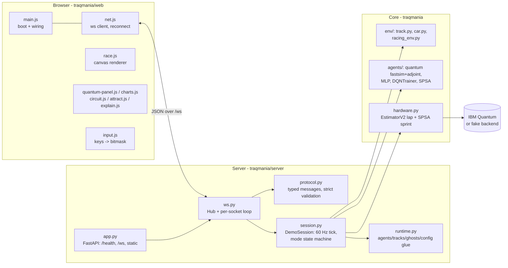

# traQmania architecture

How the pieces fit: a numpy physics/RL core, a FastAPI + WebSocket demo server
that ticks one shared session, a vanilla-ES-module browser frontend, and an
optional bridge to IBM Quantum hardware.

## System overview



## Module map

| Module | Responsibility |
|---|---|
| `traqmania/__main__.py` | CLI entry point: profile/config/host/port flags, starts uvicorn. |
| `traqmania/config.py` | `default.toml` + profile overlay (`pi4`, `pi5`, `exhibition`, plus the circuit-size overlays `q6`/`q8`/`q10` — each sets `[circuit] n_qubits` and the matching `[observation] ray_angles_deg`) + optional extra TOML; `./config/*.toml` in the working dir shadows packaged profiles. |
| `traqmania/env/track.py` | Closed-loop track geometry: resampling, arc-length projection, lidar raycasts, spatial-hash acceleration, validation. |
| `traqmania/env/car.py` | Vectorized bicycle-ish car physics (throttle/brake/drag, speed-dependent steering). |
| `traqmania/env/racing_env.py` | Gym-style vector env: obs = lidar rays (`[observation] ray_angles_deg`, 3 by default) + speed, progress reward, checkpoint/lap bonuses, off-track penalty, auto-reset. |
| `traqmania/env/trackgen.py` | Procedural track generator (numpy-only): `generate_track(seed, difficulty, length)` builds a deterministic closed loop that passes the exact `Track.load` validation (see "Random tracks" below); `LENGTH_PRESETS` maps short/medium/long to base-radius ranges and perimeter caps. |
| `traqmania/env/racing_line.py` | The model-based "hero" driver (expert demo): curvature-minimizing racing line, brake/accel-feasible speed profile from `[physics]`, pure-pursuit `RacingLineController` returning continuous (steer, throttle, brake). Not a learned agent. |
| `traqmania/env/multi_track.py` | `MultiTrackEnv`: round-robin mixture of per-track `RacingEnv`s behind the identical vector-env interface, so `DQNTrainer` trains one policy over several tracks unchanged; `random_pool` builds the mixture from generated tracks. |
| `traqmania/agents/base.py` | `QFunction` protocol + the 4 discrete actions (right/straight/left at full throttle, coast-brake — car steer +1 turns left on screen). |
| `traqmania/agents/quantum/circuit.py` | Canonical Qiskit circuit (single source of truth) + JSON `circuit_spec` for the browser diagram. |
| `traqmania/agents/quantum/fastsim.py`, `adjoint.py` | Hand-written numpy statevector simulator and adjoint (backprop-style) gradients. |
| `traqmania/agents/quantum/qdqn.py` | `QuantumQFunction`: fastsim-backed `QFunction`, flat `[lam, theta, w, b]` layout, P = 3·L·n + 8 params (56 at 4 qubits, 80 at 6). |
| `traqmania/agents/quantum/qnn.py` | Same circuit via qiskit-machine-learning `EstimatorQNN` (parity checks, shots/noise backends). |
| `traqmania/agents/classical/mlp.py` | 76-parameter numpy MLP baseline (4-8-4, tanh) with analytic backprop. |
| `traqmania/agents/training/dqn.py` | Double-DQN loop over vectorized envs, Adam, replay buffer — shared by both backends. |
| `traqmania/agents/training/spsa.py` | Minimal SPSA minimizer used by hardware sprints. |
| `traqmania/hardware.py` | IBM/fake backends via `qiskit-ibm-runtime`: `HardwareQFunction` (inference-only, EstimatorV2), `run_hardware_lap`, `spsa_sprint`; also a CLI (`python -m traqmania.hardware lap|sprint`). Backend choice is qubit-aware (`min_qubits = max(5, n_qubits)` — at 6 qubits the 5-qubit fakes are skipped and the 7-qubit `fake_lagos` is picked), and the CLI takes `--profile` (e.g. `python -m traqmania.hardware lap --fake --profile q6`). |
| `traqmania/server/protocol.py` | Typed WS messages; strict client-side validation (`ProtocolError`). |
| `traqmania/server/session.py` | `DemoSession`: the mode state machine and synchronous 60 Hz `tick()`; training threads; ghost recording. |
| `traqmania/server/runtime.py` | Loading bundled agents/weights/tracks/ghosts, track payloads, training-config resolution. |
| `traqmania/server/ws.py` | Connection `Hub`, broadcast fan-out, per-socket receive loop, `DriverLock` (exclusive control, spectators watch). |
| `traqmania/server/app.py` | FastAPI factory: `/health`, `/ws`, `/api/docs` + `/api/docs/{id}` (repo markdown for the in-UI docs browser; empty outside a source checkout) and `/docs-assets` (images), static frontend mounted last. |
| `traqmania/train_headless.py` | Offline training CLI that produces the bundled `weights/*.npz` (+ `.meta.json`, history JSON). Besides the bundled names, `--track multi` trains one policy on the oval+chicane+gp mixture and `--track random` on a `MultiTrackEnv.random_pool` of generated tracks (seeded from `--seed`); weights save under the literal names (`quantum_multi.npz` / `quantum_random.npz`) — the universal-driver candidates. |
| `traqmania/bench.py` | Micro-benchmarks (env steps, forward passes, DQN updates). |
| `tools/make_stages.py` | Trains a fresh quantum agent, snapshots parameters as it learns, and saves 4 evolution-stage weights `quantum_<track>_stage{1..4}.npz` (+ `.meta.json` with the episode count shown as the car label). |
| `traqmania/web/` | Frontend ES modules (`main`, `net`, `race`, `input`, `charts`, `circuit`, `quantum-panel`, `hardware-panel`, `attract`, `explain`); no build step, served statically. |

## Qubit-count profiles (q6 / q8 / q10)

The quantum stack is generalized over `[circuit] n_qubits`. Qubits map 1:1 to
observation features — (n − 1) lidar rays evenly spaced over [−60°, +60°]
plus normalized speed — while the **4 actions and the Z_0…Z_3 readout stay
fixed** (extra qubits only widen the feature register). The overlays set
exactly that pair of config values:

- `--profile q6` — 6 qubits, 5 rays; trained oval weights are bundled
  (`weights/quantum_oval_q6.npz`).
- `--profile q8` / `q10` — 8/10 qubits, 7/9 rays; **untrained options**:
  modes that need bundled weights stay unavailable until you train, e.g.
  `python -m traqmania.train_headless --agent quantum --profile q8`.

The default stays 4 qubits and is bit-identical to the pre-scaling stack
(pinned by a regression test). The evolution stages and the bundled MLP
(agent and race opponent) are 4-qubit-only: at n ≠ 4 the session rejects
those modes/opponents with an `error` message instead of crashing (evolution
comes back if you produce `_stage<i>` weights at that qubit count).

Weight filenames follow one rule (`server/session.quantum_weights_path`):
`quantum_<track>[_warmstart|_stage<i>][_q<n>].npz` — the `_q<n>` tag is
appended at any non-default qubit count, so a `--profile q6` run reads and
writes `quantum_<track>_q6.npz` and never clobbers the 4-qubit weights.

## Random tracks (🎲)

`env/trackgen.generate_track(seed, difficulty=0.5)` builds a procedural
closed-loop track, deterministic per `(seed, difficulty)`: random polar
harmonics around a loop, amplitude-normalized so the minimum corner radius
lands ~3× the car's kinematic minimum turn radius at difficulty 0, tightening
toward ~1.6× (and narrowing from wide to gp-like width) at difficulty 1. The
candidate is constructed through the same code path `Track.load` uses after
parsing JSON (resample + validation + precompute), so a generated track can
never be unlearnable by the load-time rules; a failing candidate retries with
rng-derived jitter (≤ 50 attempts — in practice the first attempt passes).

**Server flow** — `set_track {track: "random", seed?}` generates a track
named `random #<seed>` (a seedless request rolls a fresh seed) and broadcasts
the normal `track` payload; the UI's 🎲 picker entry sends exactly that, shows
the seed in the picker label so the track is reproducible, and offers a
reroll button. Attract / human race / live training all work as on any track.
Differences from bundled tracks:

- **Weights fallback chain** — no per-track specialist exists, so the quantum
  driver resolves to `quantum_universal[_q<n>].npz` when bundled, else the gp
  specialist `quantum_gp[_q<n>].npz` (measured to lap all three bundled
  tracks zero-shot). The car is labelled honestly: `driver: universal` or
  `driver: gp-trained generalist` (`session.random_track_weights`). Warm
  starts and evolution stages follow the same chain (`_warmstart` /
  `_stage<i>` suffixes).
- **No ghost persistence** — best-lap ghosts are never written for random
  tracks (`ghosts_dir` only ever holds bundled-track files).
- **Graceful rejections** — hardware mode needs a bundled track name (the
  runner loads tracks by name); evolution/mlp modes reject with the existing
  missing-weights `error` when their files are absent.

The universal-driver *candidates* are trained offline with
`train_headless --track multi` (bundled-track mixture) or `--track random`
(generated pool via `MultiTrackEnv.random_pool`); promoting one to
`quantum_universal.npz` is a manual bundling decision.

## WebSocket protocol reference

> **Keep in sync:** this section is hand-generated from
> `traqmania/server/protocol.py`. If you change the protocol, change this
> table in the same commit. Every message is a JSON object with a `"type"`
> field. Client→server messages are **strictly validated**: unknown types,
> unknown fields, wrong value types, and out-of-enum values all get an
> `error` reply on the offending socket (other clients are unaffected).
> Fields marked *omitted-if-null* are dropped from the wire when `None`.

### Client → server

**`hello`** `{}` — request a fresh `welcome` on this socket (also sent
automatically to every client on connect).

**`input`** — human driving input, last-writer-wins across all sockets (one
shared seat). `keys` is always required.

| field | type | required | meaning |
|---|---|---|---|
| `keys` | int 0–15 | yes | bitmask: 1 throttle, 2 brake, 4 left, 8 right (left+right cancel, brake overrides throttle) |
| `steer` | float [-1, 1] | no | analog steering (clamped at parse time) |
| `throttle` | float [0, 1] | no | analog throttle (clamped) |
| `brake` | float [0, 1] | no | analog brake (clamped) |

When **any** analog field is present the server drives from the analog values
instead of the bitmask (missing axes default to 0.0; send `keys: 0`
alongside). The analog override persists until a later keys-only `input`.

**`set_mode`** — `{mode}` with `mode` ∈ `attract | train | race | evolution |
hardware`.

**`set_track`** — `{track, seed?, length?}` with `track` a name from
`welcome.tracks` or the special name `"random"` (procedurally generated — see
"Random tracks"). `seed` (int ≥ 0, *omitted-if-null*) is only meaningful with
`track: "random"` and makes the generated track reproducible; without it the
server rolls a fresh one. `length` (`"short" | "medium" | "long"`,
*omitted-if-null*, default medium) picks a size preset; non-default lengths
are tagged into the track name (`random #7 (long)`), and long tracks are for
live driving only (laps can exceed the 60 s training-episode cap). Rejected
with an `error` while training or a hardware job is running, or for unknown
names.

**`draw_track`** — `{points}` with `points` a list of 8–5000 `[x, y]` pairs:
a freehand centerline stroke from the UI's ✏️ draw overlay (world
coordinates, any scale). `env/trackgen.track_from_drawing` recentres and
rescales it to a drivable perimeter, low-passes pointer jitter (coarse
arc-length resample) and Chaikin-rounds the corners just enough to clear the
6-unit minimum corner radius, narrows the track a little if two sections run
close, and finally constructs it through the same `Track` path as every other
track. The result is named `drawn #<n>` and behaves like a generated track
(universal-driver fallback, no ghost persistence). Drawings that cannot be
made drivable — open strokes, self-crossings, unrecoverably tight corners —
come back as an `error` naming what to fix; drawing again is the adjust flow.

**`set_driver`** — `{driver}`: pick which trained quantum weights drive the
agent car. `"auto"` (default) uses the current track's specialist with the
honest universal/gp fallback on generated tracks; a training name from
`welcome.drivers` (e.g. `"oval"`, `"gp"`, `"universal"`) forces that
training's weights on any track; `"hero"` swaps in the model-based
racing-line controller (expert demo — no weights, continuous controls, works
on every track; the stock UI only offers it with `#expert` in the URL). The
attract car rebuilds immediately; race/evolution are unaffected (`"hero"`
behaves like `"auto"` for them). Unavailable names (not bundled at the active
qubit count) get an `error`; a qubit switch silently resets an unavailable
pick to `"auto"`.

**`train`**

| field | type | required | meaning |
|---|---|---|---|
| `action` | `"start"` \| `"stop"` | yes | |
| `agent` | `"quantum"` \| `"mlp"` \| `"both"` | yes | `both` starts two side-by-side jobs |
| `track` | str | no | switch track first |
| `warm` | bool | no (default false) | start from bundled warm-start weights (quantum only) |
| `episodes` | int ≥ 1 | no | overrides the config default |

**`race`**

| field | type | required | meaning |
|---|---|---|---|
| `action` | `"start"` \| `"reset"` | yes | `reset` respawns all cars (race mode only) |
| `opponent` | `"quantum"` \| `"mlp"` | yes | |
| `track` | str | no | switch track first |

**`qubits`** — `{n}` (int ≥ 1): live circuit-size switch. The server overlays
the packaged `q{n}` profile (`n = 4` → the plain default config), rebuilds
track/env/agents/circuit state in place, resets to attract mode (car-less if
that qubit count has no bundled weights for the current track — an `error` is
emitted alongside, same as any weight-missing rejection), and re-broadcasts
the `welcome` payload so every client re-renders. Rejected with an `error`
while training or a hardware job is running, or when no packaged `q{n}`
profile exists.

**`hardware`** — run the quantum policy on an IBM backend (or a local fake
noise-model twin).

| field | type | required | meaning |
|---|---|---|---|
| `action` | `"lap"` \| `"sprint"` \| `"abort"` | yes | one inference lap / SPSA fine-tune / cancel |
| `backend` | `"fake"` \| `"real"` | yes | fake = local `FakeBackendV2`, no account needed |
| `iterations` | int ≥ 1 | no | SPSA iterations (sprint only) |
| `shots` | int ≥ 1 | no | shots per estimation (default 1024) |
| `max_decisions` | int ≥ 1 | no | lap only: cap the rollout at N backend decisions |

### Server → client

**`welcome`** — sent on connect and in reply to `hello` (and re-broadcast to
everyone after a `qubits` or `set_driver` switch):
`{mode, track: TrackPayload, tracks: [str], circuit_spec, ui, obs_labels,
driver, drivers}`. `driver` is the active `set_driver` selection (`"auto"`
default) and `drivers` the currently valid choices (`"auto"`, each bundled
training at the active qubit count, and `"hero"`).
`circuit_spec` is the JSON gate-by-gate circuit description from
`agents/quantum/circuit.circuit_spec` (qubit/layer/gate list, parameter
counts, readout observables). `ui` is the `[ui]` config section
(`attract_idle_seconds`, `kiosk`). `obs_labels` (*omitted-if-null*) is the
display name of each observation feature feeding the circuit, in qubit order
(`env.feature_names`, e.g. `["ray -60°", "ray 0°", "ray +60°", "speed"]`).

**`control`** — `{driving, locked, watchers, waiting, queue_pos,
turn_ends_in_s}`, per-client driver-lock + turn-queue status. One client at a
time controls the shared session: the first to send any control message
takes the wheel; anyone else who interacts joins a FIFO line (their control
messages are dropped and answered with this status). A solo driver keeps the
wheel indefinitely, but while the line is non-empty a turn lasts at most
`[server].driver_turn_s` (default 120 s); the wheel also frees after
`[server].driver_idle_s` (default 90 s) of driver inactivity or on
disconnect — a 1 Hz ticker (`ws.control_ticker`) performs the handover to
the next in line and keeps countdowns fresh. `driving` = this client holds
the wheel; `locked` = someone does; `watchers` = other connected clients;
`waiting` = line length; `queue_pos` (*null when not queued*) = this
client's 1-based place; `turn_ends_in_s` (*null when nobody waits*) = the
running countdown. Protects public deployments and exhibit screens from
visitors' phones fighting over the demo — and turns contention into an
arcade-style rotation.

**`track`** — `{track: TrackPayload}` after a successful track switch.

*TrackPayload* (built in `runtime.track_payload`): `name`, `half_width`,
`total_length`, `checkpoints` (fractions of a lap), `theme` (free-form dict
from the track JSON), `start: {x, y, theta}`, and polylines `centerline`,
`left`, `right` as `[[x, y], ...]`.

**`state`** — `{t: float, mode, cars: [CarState]}` at the broadcast rate.

*CarState:*

| field | type | notes |
|---|---|---|
| `id` | str | `"human"`, `"quantum"`, `"mlp"`, `"stage1..4"` (evolution), `"ghost"`, `"hardware"` |
| `kind` | `"human"` \| `"quantum"` \| `"mlp"` | |
| `x`, `y`, `theta`, `v` | float | pose + speed |
| `lap` | int | completed laps |
| `progress` | float | signed arc-length progress |
| `last_lap_time` | float \| null | null until the first lap |
| `off_track` | bool | |
| `rays` | [float] | *omitted-if-null*; normalized lidar distances (agent cars) |
| `label` | str | *omitted-if-null*; e.g. `"ep 250"` (evolution), `"best 14.4s"` (ghost), `"hardware lap"`, `"driver: gp-trained generalist"` (random track) |
| `ghost` | bool | *omitted-if-null*; true for replay cars |

**`quantum`** — live circuit introspection for a quantum car, throttled to
≤ 10 Hz per car: `{car_id, expectations: [float], q_values: [float],
action: int}` (`expectations` are the raw ⟨Z_a⟩ readouts).

**`telemetry`** — training progress per agent at the telemetry rate:
`{agent, episode, mean_return, epsilon, loss: float|null,
returns_tail: [float]}` (last ≤ 100 episode returns), plus *omitted-if-null*
`best_lap_s: float` and `lap_times: [[episode, lap_s], ...]` (last ≤ 50).

**`event`** — `{kind, car_id?, lap_time?, agent?}` with `kind` ∈
`lap | crash | clean_lap | training_done | new_best_lap` (optional fields
*omitted-if-null*; `new_best_lap` carries `agent` during training and
`car_id` for ghost records).

**`hardware_status`** — progress of a hardware lap/sprint:

| field | type | meaning |
|---|---|---|
| `phase` | `"idle"` \| `"connecting"` \| `"transpiling"` \| `"running"` \| `"replay"` \| `"done"` \| `"error"` | |
| `backend_name` | str? | resolved backend |
| `message` | str? | human-readable status / error text |
| `decision` | int? | lap: decisions completed so far |
| `seconds_per_decision` | float? | lap: measured latency |
| `iteration` | int? | sprint: SPSA iterations completed so far |
| `loss` | float? | sprint: current TD loss |
| `eval_return_before` / `eval_return_after` | float? | sprint: greedy fastsim return before/after |
| `lap_time` | float? | lap: completed lap time |

All optional fields are *omitted-if-null*; `running`-phase messages are
throttled to ≤ 5 Hz. The job itself runs in a background thread (like
training) so the tick loop never blocks on a quantum backend.

A finished hardware lap **replays in the race canvas** as a car
`{id: "hardware", kind: "quantum", ghost: true, label: "hardware lap"}`,
alongside a fastsim car driving the same weights for comparison.

**`error`** — `{message}`; sent on the offending socket for malformed input,
broadcast for session-level failures (unknown track, training already
running, a training thread crashing, ...).

## Data flow and rates

All timing derives from `[physics] dt = 1/60` and
`substeps_per_decision = 6`:

- **60 Hz physics** — `DemoSession.tick()` advances one substep per call; the
  asyncio loop (`DemoSession.run`) drives it with drift correction (and
  resyncs rather than spiraling if it falls > 0.5 s behind). Tests call
  `tick()` directly; nothing in the session requires an event loop.
- **10 Hz decisions** — every 6th substep each agent car observes (its lidar
  rays + speed), takes `argmax Q`, and holds that action for the next 6
  substeps —
  exactly matching training. `quantum` introspection messages are throttled
  to ≤ 10 Hz per car.
- **20 Hz broadcast** — `state` messages at `[server] broadcast_hz`
  (15 on the Pi profiles). Ghost replay cars are stored at decision rate
  (10 Hz) and lerped back to 60 Hz for smooth playback.
- **10 Hz telemetry** — in train mode, `telemetry`/event messages at
  `[server] telemetry_hz` (5 on Pi). Training itself runs in **background
  threads** (`DQNTrainer` on vectorized envs); the tick loop samples live car
  states via `RacingEnv.state_snapshot()` and reads shared job stats under a
  lock — the GIL-released numpy inner loops keep the server responsive.

The session is **shared**: every websocket client sees the same world; human
input is last-writer-wins, and input resets to 0 when the last client
disconnects.

## How-to guides

### Add a track

Drop `traqmania/env/tracks/<name>.json`:

```json
{
  "name": "hairpin",
  "centerline": [[x0, y0], [x1, y1], ...],
  "half_width": 7.0,
  "checkpoints": [0.25, 0.5, 0.75],
  "theme": {"surface": "asphalt", "edge": "kerb-red"}
}
```

- `centerline`: ≥ 3 `[x, y]` points tracing a **closed loop** in world units.
  A gap between the first and last point of up to 25 % of the loop length is
  auto-closed with a straight segment; larger gaps are rejected. The polyline
  is resampled to ~`[track] resample_spacing` (1.5 units) spacing on load.
- `half_width`: ≥ 3.0 (validated).
- Minimum corner radius after resampling: **6.0 units** (validated —
  `Track.load` raises `ValueError` naming the offending value).
- `checkpoints`: optional lap fractions, strictly increasing in `[0, 1)`
  (each grants `checkpoint_bonus` reward once per lap).
- `theme`: optional, passed through to the renderer untouched.

The track appears automatically in `welcome.tracks` and the UI picker
(`runtime.available_tracks()` globs the directory). Attract/race/evolution
need weights though: train and save them with

```sh
python -m traqmania.train_headless --agent quantum --track hairpin
python -m traqmania.train_headless --agent mlp --track hairpin
python tools/make_stages.py --track hairpin   # evolution-mode snapshots
```

which writes `traqmania/weights/{quantum,mlp}_hairpin.npz` + `.meta.json`
(at a non-default qubit count, pass e.g. `--profile q6` and the quantum
filenames gain the `_q6` tag — see the filename rule above).
Slow-to-learn tracks can get a `[training_presets.hairpin]` section in
`default.toml` (merged onto `[training]` by `runtime.resolve_training_cfg`).

### Add an agent

Implement the `QFunction` protocol from `traqmania/agents/base.py` — batched
numpy, parameters in one flat vector:

```python
class MyQFunction:
    n_features: int   # lidar rays + speed (4 at the default config)
    n_actions: int    # always 4 = right / straight / left / brake

    def q_values(self, obs):            # (B, F) -> (B, A)
    def grad_selected(self, obs, action_idx, upstream):  # -> (P,)
        # gradient of sum_b upstream[b] * Q[b, action_idx[b]] wrt flat params
    def get_params(self):               # -> (P,)
    def set_params(self, params): ...
```

`DQNTrainer` works unchanged with any implementation (the target network is
just a second flat parameter vector). To expose it in the demo, wire it into
`runtime.load_agent` and add the kind to the relevant enums in `protocol.py`
(`CAR_KINDS`, plus `OPPONENTS`/`TRAIN_AGENTS` if it should be raceable /
trainable) — and update the protocol reference above. `QuantumQFunction` and
`MLPQFunction` are the reference implementations; `HardwareQFunction` shows a
legitimate partial one (inference-only, `grad_selected` raises).

### Add a mode

1. Add the name to `MODES` in `protocol.py` (client `set_mode` validation).
2. In `session.py`, handle it in `_set_mode` and write an `_enter_<mode>`
   that builds `self.cars` (see `_enter_evolution` for a multi-car example);
   extend `tick()` if the mode needs non-default per-substep behavior.
3. Frontend: add a `<button data-mode="...">` in `index.html` and any
   mode-specific UI in `main.js` (`applyMode`).
4. Update the protocol reference above and `docs/EXHIBITION.md` talking
   points.
